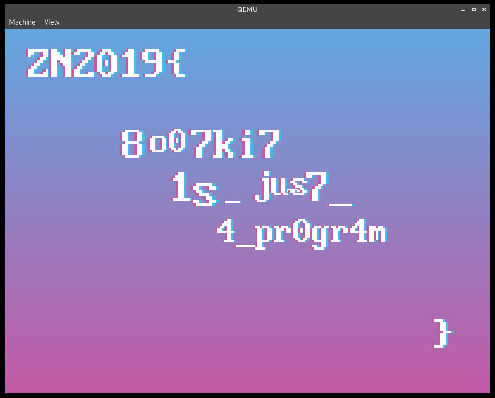

# bootkit


## Description

```
Our old MBR-loaded server was infected with some virus and now it doesn't load correctly.
However, hackers left the program for sector-by-sector disk reading.
Please look, may be you can do something with it?

```

## Source
```
.
└── bootkit
    ├── service
    │   ├── wrapper
    │   │   ├── wrapper
    │   │   └── wrapper.c
    │   └── disk
    │       ├── build.sh
    │       ├── disk.bin
    │       ├── glyph.bin
    │       ├── loader.asm
    │       └── main.c
    └── deploy.sh
    
```

## Build

* NASM
* GCC
* dd

```build.sh``` build the sources and create the image of disk.

## Run

* QEMU

```qemu-system-i386 ./service/disk/disk.bin``` or just build the project.
