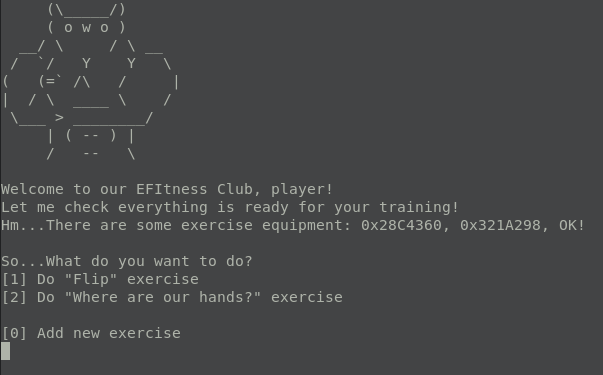

# EFItness


## Description

```
Do some effective exercise for our EFItness Club!

nc <IP> <PORT>

The flag is located in the file "flag" in root directory of disk.
It's important to use "\r\n", not "\n".

```

## Source
```
.
└── efi-tness
    ├── exploit
    │   ├── exploit_local.py
    │   └── exploit.py
    ├── public
    │   ├── readme.md
    │   ├── run-qemu.sh
    │   ├── efitness
    │   └── ovmf
    ├── service
    │   ├── EFItness\VS2017\EFItness.sln
    │   ├── edk2
    │   │   ├── EmulatorPkg
    │   │   └── OvmfPkg
    │   └── Build
    │       ├── EFItnessX64\DEBUG_VS2017\X64\EFItness.efi
    │       ├── EmulatorX64\DEBUG_VS2017\X64\WinHost.exe
    │       └── OvmfPkgX64\DEBUG_VS2017\X64\FV
    └── deploy
        └── run-qemu.sh
    
```

## Build

* [EDK II](https://github.com/tianocore/edk2)
* Visual Studio 2017/2019 (might be skipped)

To make all directories on one level you should set 2 environment variables (already setted in .bat-files):
```
set WORKSPACE=%~dp0..\..
set PACKAGES_PATH=%~dp0..\..\edk2;%~dp0..\..
```

Binaries are available in ```./public```

## Run

* QEMU

Just run ```./run-qemu.sh```
